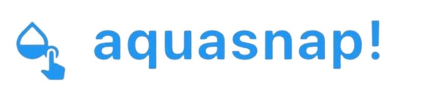

# AquaSnap

<p align="center">
  
</p>

## Mission Statement

AquaSnap is a mobile app that allows users to take precise and easy action on water waste. By utilizing key OpenData NI insights, such as the annual water leakage rates in Belfast (180 ML/day in 2018) and wastewater compliance data, AquaSnap combines innovative AI with community action for real impact.

The core features of the app are snapping and reporting water leaks, real-time AI categorization of issues, and the provision of DIY repair solutions for minor fixes. For larger problems, AquaSnap connects the user to local authorities through an emergency helpline. On the community board, users can track progress, upvote critical issues, and celebrate achievements.

By gamifying water preservation, users can earn Aqua points and unlock badges for every action while monitoring their environmental impact. Unique features such as monthly leaderboards and 24/7 support make AquaSnap a comprehensive solution to save water and improve infrastructure – one snap at a time.

## About

AquaSnap is a mobile app that empowers communities to take action on water waste in Northern Ireland. Using AI-powered real-time categorization, reporting tools, and gamification, the app helps users detect and fix leaks while engaging with local authorities. Built with React Native, JavaScript, and the @react-native-material/core UI library, AquaSnap delivers an intuitive and interactive experience for water conservation in Northern Ireland.

## Features

- 📸 **Snap & Report**: Easily take photos of water leaks and submit reports
- 🤖 **AI Categorization**: Real-time analysis and categorization of water issues
- 🛠️ **DIY Solutions**: Instructions for fixing minor water problems
- 🚨 **Emergency Assistance**: Direct connection to local authorities for major issues
- 👥 **Community Board**: Track progress and upvote critical issues
- 🏆 **Gamification**: Earn Aqua points and badges for conservation efforts
- 📊 **Leaderboards**: Monthly rankings to encourage community participation
- 📱 **24/7 Support**: Continuous assistance for water conservation issues

## Tech Stack

- React Native
- Expo
- JavaScript
- @react-native-material/core
- Expo Vector Icons

## Project Structure

```
aquasnap-app/
├── assets/
│   ├── adaptive-icon.png
│   ├── favicon.png
│   ├── icon.png
│   ├── splash-icon.png
│   └── snack-icon.png
├── components/
│   ├── Community.js  - Community discussion forum
│   ├── Header.js     - App header with logo
│   ├── Help.js       - Support and assistance
│   ├── Leaderboard.js - User rankings and achievements
│   └── SnapPhoto.js  - Water leak reporting interface
├── .gitignore
├── app.json
├── index.js
├── package.json
├── App.js
└── README.md
```

## Component Overview

### Header.js
The Header component displays the app's logo and title. It features a clean design with the AquaSnap logo, which consists of a water droplet icon and a touch icon, along with a distinctive blue wave accent.

### Community.js
The Community component provides a forum-like interface where users can:
- View posts about water waste issues
- Upvote important reports
- Comment on existing posts
- Reply to comments
- Share DIY solutions
- Connect with other community members

Users can discuss water conservation tips, report leaks, and share successful repair stories. The component includes features for nested comments, upvoting, and interactive discussions.

### Other Components
- **SnapPhoto.js**: Interface for taking photos of water leaks and submitting reports
- **Help.js**: Provides assistance and connects users to emergency services
- **Leaderboard.js**: Displays user rankings and achievements based on water conservation activities

## Installation

1. Clone the repository:
```bash
git clone https://github.com/Nazzal-hmm/AquaSnap.git
cd AquaSnap
```

2. Install dependencies:
```bash
npm install
```

3. Start the development server:
```bash
expo start
```

## Dependencies

- "@expo/vector-icons": For UI icons
- "@react-native-material/core": For Material Design components
- "expo": For React Native development
- "react": Core React library
- "react-native": React Native framework

## Contributing

Contributions are welcome! Please feel free to submit a Pull Request.

## License

This project is licensed under the MIT License - see the LICENSE file for details.

## Contact

For any inquiries, please reach out to [ahmednazzal1710@gmail.com](mailto:ahmednazzal1710@gmail.com).

---

Made with 💧 for Northern Ireland's water conservation efforts.
